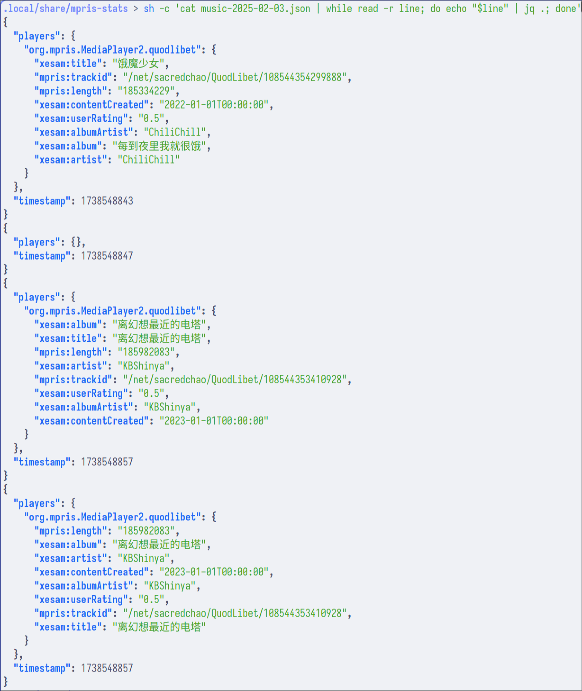

# MPRIS-Stats

A tiny daemon to log playing music using MPRIS protocol.



**This is a daemon program; actual analysis needs to take place separately.**

*Much of the code is taken from [waylrc](https://github.com/hafeoz/waylrc). Make sure to contribute the same code to both project to keep them up-to-date.*

## Installation

### Build from source

You need to have [cargo](https://www.rust-lang.org/tools/install) installed.

```bash
git clone https://github.com/hafeoz/mpris-stats.git && cd mpris-stats
cargo build --release && cp target/release/mpris-stats ~/.local/bin/
```

### Binary release

Prebuilt binaries produced by [GitHub workflow](./.github/workflows/release.yml) can be found in [release page](https://github.com/hafeoz/mpris-stats/releases/latest).

## Usage

Autostart this porgram. By default logs will be present under `$XDG_DATA_HOME/mpris-stats/music-[year]-[month]-[day].json`.

Each line should be a `json`-formatted record. Record will be made when the player is modified (added, removed, song changed, etc.). If no player modification is detected, a keep-alive record will be made every 60 seconds.

## License

This software is licensed under [BSD Zero Clause](https://spdx.org/licenses/0BSD.html) OR [CC0](https://spdx.org/licenses/CC0-1.0.html) OR [WTFPL Version 2](https://spdx.org/licenses/WTFPL.html).
You may choose any of them at your will.
